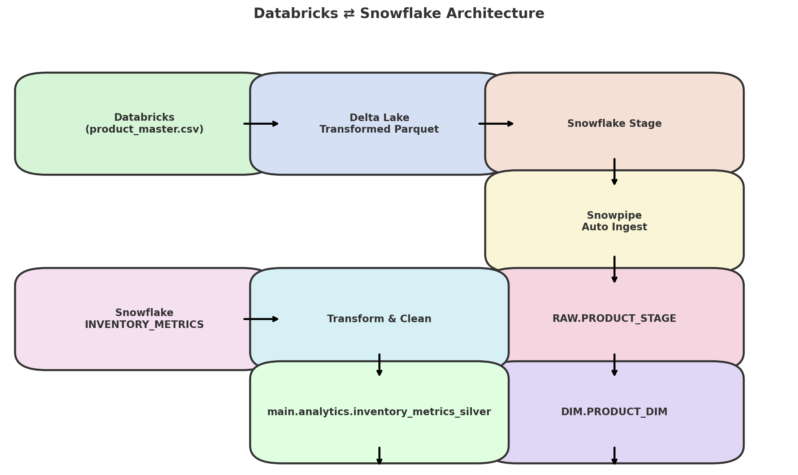

# 🔁 Databricks ⇄ Snowflake Integration Pipeline

This project demonstrates a robust, bi-directional data integration pipeline between **Databricks** and **Snowflake**, including:

- ⏫ Pushing transformed data from Databricks to Snowflake via **Snowpipe**
- ⏬ Pulling Snowflake data into Databricks and writing to **Unity Catalog**
- 📦 Organizing data using Delta Lake: `raw` and `silver` layers
- ✅ Ready for enterprise-scale workloads using 100K+ rows

---

## 📊 Architecture



---

## 📁 Project Structure

```
Databricks_Snowflake_Integration/
├── data/
│   ├── product_master.csv                  # 100K+ rows (Databricks to Snowflake)
│   └── inventory_metrics.csv               # 100K+ rows (Snowflake to Databricks)
├── notebooks/
│   ├── 01_push_product_to_snowflake.py     # PySpark → Snowflake external stage
│   ├── 02_pull_inventory_from_snowflake.py # Snowflake → Databricks catalog
│   └── utils.py
├── snowflake/
│   ├── snowpipe_setup.sql                  # Create stage + Snowpipe
│   └── snowflake_etl_pipeline.sql          # ELT merge into DIM tables
├── catalog/
│   └── schema_definition.sql               # Table DDLs for Snowflake & Unity Catalog
├── architecture.png                        # Visual pipeline diagram
├── README.md
└── requirements.txt
```

---

## 🔄 Pipeline Flow

### ➤ **1. Databricks ➝ Snowflake (Push)**

| Step | Description |
|------|-------------|
| 🔍 Read `product_master.csv` | Transform and clean data using PySpark |
| 💾 Write to external stage   | Save as Parquet to S3/Azure Blob (linked to Snowflake stage) |
| 🔁 Trigger Snowpipe         | Auto-ingest into `PROD_DB.RAW.PRODUCT_STAGE` |
| 🧠 Run ELT in Snowflake     | Merge into `PROD_DB.DIM.PRODUCT_DIM` |

---

### ➤ **2. Snowflake ➝ Databricks (Pull)**

| Step | Description |
|------|-------------|
| ❄️ Read from Snowflake      | Use Spark connector to fetch `INVENTORY_METRICS` |
| 🧹 Clean and transform       | Add derived columns, filter, and normalize |
| 🧾 Save to Unity Catalog     | Write final table to `main.analytics.inventory_metrics_silver` (Delta)

---

## 📈 Datasets

- **`product_master.csv`**: Simulates product dimension (100K+ rows, 12 columns)
- **`inventory_metrics.csv`**: Simulates inventory fact metrics (100K+ rows, 10 columns)

---

## 🛠️ Technologies Used

- **Databricks Runtime** (15.4+)
- **Delta Lake**
- **Unity Catalog**
- **Snowflake Snowpipe**
- **Parquet format**
- **S3 / Azure Blob (used both as external stage)**

---

## 🧾 Output Tables

| Platform   | Database / Catalog | Table                                 | Layer     |
|------------|--------------------|----------------------------------------|-----------|
| Snowflake  | `PROD_DB.RAW`      | `PRODUCT_STAGE`                        | Raw       |
| Snowflake  | `PROD_DB.DIM`      | `PRODUCT_DIM`                          | Final     |
| Databricks | `main.analytics`   | `inventory_metrics_silver`            | Silver    |

---

## 🚀 Getting Started

### 1. Upload CSV files:
Upload `product_master.csv` and `inventory_metrics.csv` to `/data/`

### 2. Configure Snowflake Connector in Databricks:

Update `sf_options` in `02_pull_inventory_from_snowflake.py` with your credentials:
```python
sf_options = {
    "sfURL": "your_account.snowflakecomputing.com",
    "sfDatabase": "PROD_DB",
    "sfSchema": "METRICS",
    ...
}
```

### 3. Set up Snowflake Stage + Snowpipe:
Run `snowflake/snowpipe_setup.sql` from Snowflake worksheet

### 4. Run ELT Pipeline:
Execute `snowflake/snowflake_etl_pipeline.sql` in Snowflake to merge raw data
